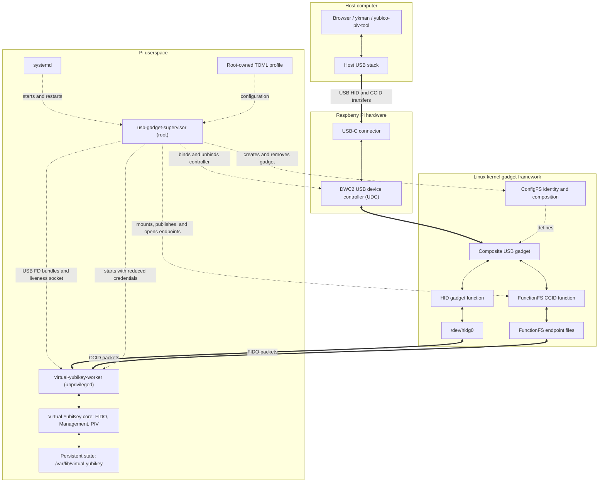
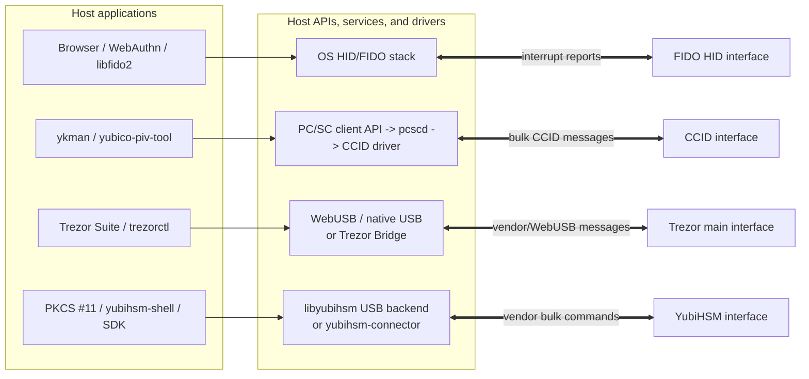
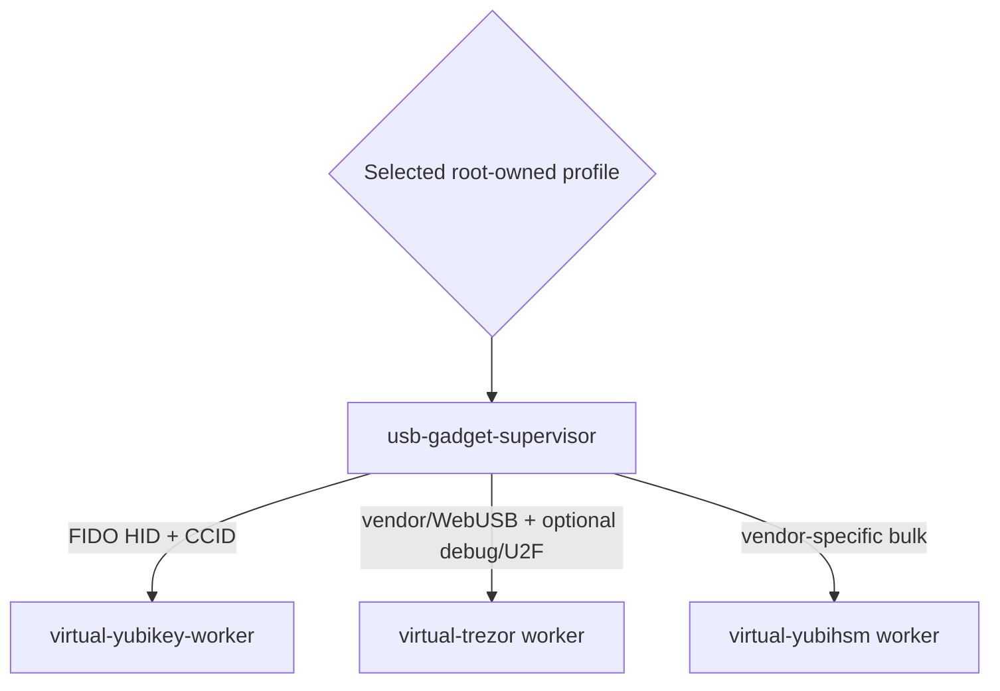

# USB gadget architecture

This guide explains how Raspberry Pi USB gadget mode presents Virtual YubiKey
to a host, and where the separate `usb-gadget-supervisor` fits. The central
design rule is that the supervisor owns privileged setup and lifecycle, while
ordinary USB payloads travel directly between Linux endpoint files and the
unprivileged worker.

A printable version is available as
[USB gadget architecture (PDF)](../output/pdf/usb-gadget-architecture.pdf).

## System architecture

Solid arrows below carry USB protocol data. Dashed arrows carry configuration
or lifecycle control.



## Component responsibilities

| Component | Responsibility |
| --- | --- |
| Host USB stack | Discovers the composite USB device and routes HID and CCID transfers to host applications. |
| DWC2 UDC | Implements the Raspberry Pi's USB 2.0 device-side controller on the USB-C connector. |
| ConfigFS | Defines the host-visible device identity, configuration, and ordered functions. |
| HID gadget function | Exposes the FIDO interface through `/dev/hidg0`. |
| FunctionFS | Exposes the CCID control and data endpoints to the worker. |
| `usb-gadget-supervisor` | Validates and publishes profile descriptors, opens USB resources, starts and monitors workers, binds the UDC, rebuilds incarnations, and cleans up. |
| `virtual-yubikey-worker` | Receives already-open USB FDs, handles runtime events and endpoint traffic, and implements transport framing. |
| `virtual-yubikey-core` | Implements Management, PIV, FIDO2, credentials, policy, cryptography, and persistent logical state. |

## UDC, ConfigFS, and FunctionFS

These three names describe different layers. They cooperate, but they are not
interchangeable:

```text
UDC        = the physical USB device-side controller and its kernel driver
ConfigFS   = the control surface used to assemble a USB device
FunctionFS = the data/control endpoint surface used to implement a function in userspace
```

An analogy is useful:

- The **UDC is the USB engine and socket**. It sends and receives electrical USB
  packets and exposes hardware endpoints to the Linux gadget framework.
- **ConfigFS is the wiring and identity plan**. It tells the kernel which device
  to build: VID/PID, strings, configurations, functions, interface order, power
  declaration, and the UDC to which the completed gadget should attach.
- **FunctionFS is a service hatch into one function**. Userspace supplies that
  function's USB descriptors and reads or writes its endpoint files. In this
  design the supervisor performs the one-time publication and the worker uses
  the resulting open files for the actual protocol.

### UDC: the device-side hardware

UDC means **USB Device Controller**. On Raspberry Pi 4 and Pi 5 gadget mode,
this is the DWC2 controller behind the USB-C connector. Its kernel driver deals
with registers, interrupts, FIFOs, DMA, endpoint availability, cable state, and
USB packet transfer. Higher layers do not need to know those hardware details.

Linux lists registered device controllers under `/sys/class/udc`. A controller
being listed means the kernel has a device-side controller available; it does
not mean a gadget is already attached to it.

Only one gadget driver can normally own a given UDC at a time. Writing a UDC
name into a gadget's ConfigFS `UDC` file performs the bind. Writing an empty
string performs the unbind, which appears to the host as a physical USB
disconnect.

### ConfigFS: assemble and activate the device

ConfigFS is a userspace-driven kernel configuration filesystem, normally
mounted at `/sys/kernel/config`. Its directories and attribute files are not
ordinary persistent files. Creating directories and writing attributes creates
and configures live kernel objects.

For a USB gadget, ConfigFS describes questions such as:

- What are the vendor ID, product ID, USB version, and device version?
- What manufacturer and product strings should the host receive?
- Which USB configurations exist?
- Which functions and interfaces belong to each configuration, and in what
  order?
- Which UDC should expose the finished gadget to the host?

A simplified Virtual YubiKey tree looks like this:

```text
/sys/kernel/config/usb_gadget/virtual-yubikey/
├── idVendor                         # 0x1050
├── idProduct                        # 0x0406
├── strings/0x409/manufacturer       # Virtual USB Gadget
├── strings/0x409/product            # Virtual Yubico YubiKey FIDO+CCID
├── functions/
│   ├── hid.fido                     # kernel HID gadget function
│   └── ffs.ccid                     # userspace FunctionFS function
├── configs/c.1/
│   ├── hid.fido -> ../../functions/hid.fido
│   └── ffs.ccid -> ../../functions/ffs.ccid
└── UDC                              # write 1000480000.usb to attach
```

The symbolic links compose the functions into a configuration. Nothing is
host-visible merely because this tree exists. The final write to `UDC` binds
the complete definition to physical device-side hardware and permits host
enumeration.

ConfigFS is therefore primarily a **configuration and lifecycle path**, not a
path through which normal FIDO or CCID packets flow.

The product string deliberately contains the contiguous words `Yubico
YubiKey`. Yubico's PC/SC discovery treats readers without that text as NFC
readers. Keeping it in the visibly virtual product name lets the CCID and HID
interfaces be recognized as transports of the same USB device rather than as
separate NFC and USB devices. Stock Yubico Authenticator computes its visible
model name from the compatibility identity and Management response rather than
from this product string, so it can still display `YubiKey 5A`. The profile is
therefore a local interoperability-test identity, not a claim of product
origin.

### FunctionFS: implement a USB function in userspace

Some standard functions can live almost entirely in the kernel. The FIDO HID
interface uses the ConfigFS HID function, which exposes `/dev/hidg0` to the
worker. CCID is different: Virtual YubiKey implements its CCID protocol in
userspace, so it uses FunctionFS.

The supervisor mounts an instance such as:

```text
/dev/ffs-virtual-yubikey/
```

Initially that mount provides `ep0`. The descriptor contents live in the
device project's root-owned profile. The supervisor validates them, writes the
FunctionFS descriptor and string tables to `ep0`, and derives the expected
endpoint order and direction. FunctionFS then creates endpoint files
corresponding to those descriptors, conceptually:

```text
/dev/ffs-virtual-yubikey/
├── ep0    # setup requests, events, descriptors and control handling
├── ep1    # one CCID data direction
├── ep2    # the other CCID data direction
└── ep3    # CCID interrupt notifications
```

The supervisor opens `ep0` and all three data endpoints, then transfers
duplicates to the unprivileged worker with `SCM_RIGHTS`. The worker retains
`ep0` for runtime `ENABLE`, `DISABLE`, `UNBIND`, and `SETUP` events; it does not
publish descriptor data. The `ep1`, `ep2`, and `ep3` names are local
FunctionFS handles. FunctionFS maps them to the actual endpoint numbers
assigned when the composite gadget is
assembled, so the worker does not hard-code global interface or endpoint
numbers.

Once attached, a host CCID OUT transfer becomes readable bytes on a FunctionFS
endpoint file. A worker write to the corresponding IN endpoint becomes a USB
transfer back to the host. Closing all FunctionFS files disables that function.

### Why both ConfigFS and FunctionFS are necessary here

ConfigFS answers **"what USB device should Linux expose?"** FunctionFS answers
**"which userspace process implements this particular USB function, and how do
its endpoint bytes move?"**

For Virtual YubiKey:

| Interface | Device composition | Runtime protocol path |
| --- | --- | --- |
| FIDO HID | ConfigFS `hid.fido` function | `/dev/hidg0` directly to the worker |
| CCID | ConfigFS `ffs.ccid` function | FunctionFS `ep*` files directly to the worker |

The device project owns the descriptor contents. The supervisor validates and
publishes them, prepares both mechanisms, opens every USB path, and binds the
UDC. The worker owns runtime protocol behavior over the received FDs.

## Supervisor startup sequence

```mermaid
sequenceDiagram
    participant S as systemd
    participant G as Supervisor (root)
    participant K as Linux gadget framework
    participant W as Worker (unprivileged)
    participant H as Host computer

    S->>G: Start service
    G->>G: Validate profile and acquire UDC lock
    G->>K: Create unbound ConfigFS gadget
    G->>K: Mount FunctionFS; publish and open endpoints
    G->>W: Drop credentials and start worker
    G-->>W: PREBIND_RESOURCES + FunctionFS FDs
    W-->>G: PREPARED
    G->>K: Link functions and write UDC name
    K->>H: Connect and enumerate over USB
    G->>K: Open post-bind HID node
    G-->>W: POSTBIND_RESOURCES + HID FD
    W-->>G: SERVING
    H<<->>W: HID and CCID traffic through kernel endpoints
```

The gadget remains unbound while it is incomplete. The host sees it only after
the supervisor has published FunctionFS descriptors, the worker has accepted
its pre-bind bundle, and every configured function has been linked.

## What the supervisor does

The supervisor:

1. Loads and strictly validates the root-owned TOML profile.
2. Acquires the global UDC lifecycle lock.
3. Ensures ConfigFS and `libcomposite` are available.
4. Creates an unbound ConfigFS gadget and its USB identity.
5. Mounts FunctionFS root-only, validates and publishes descriptor blobs, and
   opens each generated endpoint with direction-appropriate access.
6. Opens profile-approved local character devices and claims exact GPIO line
   groups.
7. Creates a private `AF_UNIX` `SOCK_SEQPACKET` resource/liveness channel and
   places the worker end on fixed descriptor 3.
8. Clears supplementary groups, drops the worker's GID and UID, enables
   `PR_SET_NO_NEW_PRIVS`, and starts the worker.
9. Transfers the ordered FunctionFS and local-hardware FD bundle and waits for
   `PREPARED`.
10. Links functions in deterministic order and binds the selected UDC.
11. Opens post-bind nodes such as `/dev/hidg0`, transfers their FDs, and waits
    for `SERVING`.
12. On worker exit, unbinds first, cleans the incarnation, and constructs a
    fresh worker process; on service stop it performs final cleanup and exits.

It does not parse CTAP, CCID, APDU, PIN, credential, or private-key data. It is
not an application-level USB proxy.

## Direct USB data paths

FIDO HID traffic follows this path:

```text
host application
  <-> host USB stack
  <-> USB-C / DWC2 UDC
  <-> Linux HID gadget function
  <-> /dev/hidg0
  <-> virtual-yubikey-worker
```

CCID and PIV traffic follows this path:

```text
host smart-card application
  <-> host USB stack
  <-> USB-C / DWC2 UDC
  <-> Linux FunctionFS
  <-> FunctionFS endpoint files
  <-> virtual-yubikey-worker
```

Neither path crosses the supervisor process. This avoids an extra copy, keeps
latency predictable, and prevents the root process from handling untrusted USB
payloads or cryptographic secrets.

## What the host computer does

USB does not use client/server terminology at its lowest level. The host is the
bus controller and initiates transfers; the Pi is the USB device and responds.
At higher levels there may still be client libraries and server processes such
as `pcscd` or `yubihsm-connector`.

When the supervisor binds the gadget to the UDC, the host detects an attachment
and enumerates it:

1. The host resets the port, assigns a USB address, and reads the device,
   configuration, interface, endpoint, string, HID, and class-specific
   descriptors.
2. The operating system considers each interface independently and chooses an
   appropriate driver or userspace access mechanism.
3. An application talks through that interface's normal host API. It does not
   need to know that the device is implemented by Linux on a Raspberry Pi.
4. The host stack turns API operations into USB transfers. On the Pi, the UDC
   and gadget framework deliver those transfers to `/dev/hidg0` or FunctionFS
   endpoint files.

The same composite device can therefore use several host paths at once:



### Case 1: HID, including FIDO/CTAP

The FIDO interface declares USB class `0x03` (HID) and a FIDO usage page in its
HID report descriptor. The operating system's HID machinery discovers it
without a product-specific kernel driver. FIDO software such as a browser,
platform WebAuthn implementation, or `libfido2` uses the operating system's
HID access API.

CTAPHID uses fixed-size reports, commonly 64 bytes for full-speed devices, over
an interrupt OUT endpoint and an interrupt IN endpoint. Larger CTAP messages
are split into an initial packet followed by continuation packets.

```text
browser or FIDO client
  -> WebAuthn / FIDO client stack
  -> host HID API and HID driver
  -> USB interrupt OUT reports
  -> Pi /dev/hidg0
  -> virtual-yubikey-worker
  -> response returns through interrupt IN reports
```

The word "interrupt" does not mean the application is interrupting the device.
It is the USB transfer type: the host polls the endpoint on a bounded schedule.

### Case 2: CCID smart-card traffic

The CCID interface declares USB class `0x0b`. Applications normally do not open
the raw USB interface themselves. They use the cross-platform PC/SC API.

On Linux, `libpcsclite` is the application-side client library, `pcscd` is a
local server daemon, and the CCID driver owns the USB interface. The CCID driver
uses bulk OUT and bulk IN endpoints for commands and responses plus an optional
interrupt IN endpoint for slot-status notifications. Windows and macOS provide
equivalent smart-card middleware.

```text
ykman or yubico-piv-tool
  -> PC/SC API
  -> pcscd / system smart-card service
  -> CCID host driver
  -> USB bulk CCID message
  -> Pi FunctionFS endpoint
  -> virtual-yubikey-worker
  -> CCID framing -> APDU -> Management or PIV applet
```

This middleware provides discovery, reader naming, card insertion state,
transactions, and multi-application arbitration. The Pi looks like a CCID
reader containing one permanently inserted smart card.

### Case 3: Trezor vendor/WebUSB transport

Trezor Suite or `trezorctl` exchanges framed Trezor protocol messages with the
device's main USB interface. Modern host paths can access the vendor/WebUSB
interface directly through browser WebUSB or a native USB transport.

Trezor Bridge is an alternative host-side daemon. It owns access to the USB
device and exposes a local HTTP API to applications or webpages. It remains
useful where WebUSB is unavailable, for older HID-only firmware, or when one
process must coordinate USB ownership across browser domains.

```text
Trezor Suite / trezorctl
  -> direct WebUSB or native USB transport
     OR Trezor Bridge HTTP service
  -> Trezor vendor/WebUSB USB interface
  -> Pi FunctionFS OUT/IN endpoint files
  -> virtual-trezor worker
  -> Trezor message decoder and upstream legacy firmware
```

The proposed Pi worker uses a platform HAL rather than emulating an STM32 CPU.
Its main vendor/WebUSB endpoint traffic goes through FunctionFS. A selected
profile can additionally expose a debug interface or U2F HID interface.

USB carries commands and responses, but physical confirmation remains local to
the virtual appliance: upstream Trezor firmware draws its framebuffer, the Pi
HAL sends it to the attached OLED, and GPIO buttons provide No/Yes input. The
supervisor opens the I2C/SPI bus and claims two exact GPIO v2 line groups: one
output handle for display control and one pollable input/event handle for all
buttons. It closes the broad GPIO-chip descriptor before the worker starts and
passes only the line-request handles. The worker therefore knows semantic bit
positions, not GPIO paths or offsets, and cannot claim additional lines. It
blocks on button events while idle and takes immediate atomic value snapshots
only when firmware behavior needs them. The supervisor does not interpret
wallet screens, buttons, seeds, or signing requests.

### Case 4: vendor-specific bulk USB, such as YubiHSM 2

Bulk is a USB transfer type rather than a complete device class. A
vendor-specific device normally has no generic operating-system protocol stack,
so a userspace library claims its USB interface and talks through a raw USB API
such as `libusb` or WinUSB.

Yubico's direct `libyubihsm` USB backend finds the YubiHSM by VID/PID, claims
interface 0, and uses bulk endpoint `0x01` for OUT and `0x81` for IN. It exposes
this as the `yhusb://` connector URL. In that mode the application process has
direct, normally exclusive access to the USB interface:

```text
yubihsm-shell / yubihsm-pkcs11 / application
  -> libyubihsm with yhusb://
  -> libusb or platform raw-USB backend
  -> USB bulk OUT/IN
  -> virtual YubiHSM FunctionFS endpoints on the Pi
  -> virtual-yubihsm worker
```

Alternatively, `yubihsm-connector` owns the local USB interface and exposes an
HTTP service. Applications use the same `libyubihsm` API with an `http://` or
`https://` connector URL:

```text
local or remote application
  -> libyubihsm HTTP backend
  -> HTTP POST
  -> yubihsm-connector on the USB host
  -> libusb bulk OUT/IN
  -> virtual YubiHSM on the Pi
```

The connector is a server at the HTTP layer and a USB host-side client of the
device protocol. It is optional: direct USB and connector-mediated access are
two alternative host architectures.

A future `virtual-yubihsm-worker` would naturally publish its vendor-specific
bulk descriptors through FunctionFS and read/write its bulk endpoint files.
The generic supervisor would not need YubiHSM knowledge; only the device profile
and worker would change.

### Host-side comparison

| Device interface | Host-visible class | Usual host access | USB transfers | Pi userspace endpoint |
| --- | --- | --- | --- | --- |
| FIDO HID | HID (`0x03`) | WebAuthn/FIDO stack through OS HID APIs | Interrupt OUT/IN reports | `/dev/hidg0` |
| CCID | Smart card/CCID (`0x0b`) | PC/SC service and CCID driver | Bulk OUT/IN, optional interrupt IN | FunctionFS `ep*` |
| Trezor main transport | Vendor/WebUSB | WebUSB/native transport or Trezor Bridge | Primarily bulk OUT/IN | FunctionFS `ep*` |
| YubiHSM-style device | Vendor-specific | `libyubihsm`/`libusb`, directly or through a connector | Bulk OUT/IN | FunctionFS `ep*` |

Permissions and ownership also differ. HID and CCID are normally mediated by
operating-system subsystems. Direct vendor USB usually needs an OS rule granting
one account or group access to the raw USB device. If a connector service is
used, only that service account needs raw USB permission.

## The three virtual appliance profiles

The generic supervisor does not run all three identities simultaneously on one
Pi USB-C port. One UDC binds one selected profile and worker at a time:



| Virtual appliance | Host-facing applications | USB interfaces | Pi endpoint implementation | Device-specific worker responsibility |
| --- | --- | --- | --- | --- |
| Virtual YubiKey | Browser/WebAuthn, `ykman`, `yubico-piv-tool` | FIDO HID plus CCID | `/dev/hidg0` plus FunctionFS | CTAPHID, CCID, Management, PIV, FIDO2, keys and state |
| Virtual Trezor | Trezor Suite, `trezorctl`, Trezor Connect | Main vendor/WebUSB, optional debug and U2F HID | Primarily FunctionFS; profile-selected HID where appropriate | Trezor framing, legacy firmware, OLED framebuffer, buttons, wallet state |
| Virtual YubiHSM | `yubihsm-shell`, PKCS #11 module, SDKs | Vendor-specific bulk OUT/IN | FunctionFS | YubiHSM sessions, commands, objects, capabilities, audit and state |

The common boundary remains unchanged:

```text
usb-gadget-supervisor
  = root-owned profile, descriptor publication, open USB FDs, ConfigFS, UDC,
    credentials, lifecycle

selected device worker
  = ep0 runtime events, endpoint traffic, protocol, cryptography, policy, UI, state
```

The Virtual YubiKey and Virtual Trezor workers implement this resource boundary.
The Trezor host-facing behavior and the future YubiHSM worker must still be
validated against the real applications listed above before compatibility is
claimed.

## UDC discovery and binding

After the `dwc2` overlay is enabled, Linux registers each available USB Device
Controller under:

```text
/sys/class/udc
```

Typical controller names are:

| Board | Typical UDC name |
| --- | --- |
| Raspberry Pi 4 | `fe980000.usb` |
| Raspberry Pi 5 | `1000480000.usb` |

The supervisor reads every directory entry, sorts the names, and selects the
first one. If `--udc NAME` is supplied, it instead requires that exact entry.
It fails closed if no UDC is present. Binding consists of writing the selected
name to:

```text
/sys/kernel/config/usb_gadget/<gadget-name>/UDC
```

More than one UDC is unusual on a standard Pi. It can occur with virtual test
drivers such as `dummy_hcd`, custom carrier hardware, an additional device
controller, or a virtualized test environment. Use `--udc` when selection must
be deterministic in a multi-UDC system.

## Lifecycle and failure containment

The private version-1 channel carries fixed eight-byte state records and attached file
descriptors via `SCM_RIGHTS`. It never carries normal USB frames.

```mermaid
stateDiagram-v2
    [*] --> Preparing
    Preparing --> AwaitingWorker: publish/open FunctionFS; send PREBIND_RESOURCES
    AwaitingWorker --> Binding: PREPARED
    Binding --> Running: bind; send POSTBIND_RESOURCES; receive SERVING
    Running --> Cleaning: worker exit or EOF
    Cleaning --> Preparing: fresh worker incarnation
    Preparing --> FinalCleanup: service stop or setup failure
    AwaitingWorker --> FinalCleanup: service stop or timeout
    Binding --> FinalCleanup: service stop or bind failure
    Running --> FinalCleanup: service stop
    FinalCleanup --> [*]: UDC unbound and owned resources removed
```



If the worker exits or closes the channel while attached, the supervisor
immediately unbinds the UDC. It then removes that incarnation's resources and
starts a new process with a new immutable FD bundle while the supervisor
service remains running. A firmware reconnect request uses this same complete
process-reset path.

## Privilege boundary

The supervisor must run as root because ConfigFS creation, FunctionFS mounts,
descriptor publication, endpoint opening, UDC binding, and credential setup are privileged Linux
operations. The protocol worker does not need those privileges.

The worker receives only its validated resource contract: control socket FD 3,
state/runtime paths, already-open USB descriptors, approved local-device
descriptors, and exact GPIO line-request handles. The supervisor rejects raw
GPIO-chip resources. All handles arrive through fixed protocol positions;
there are no descriptor-number environment variables. The worker receives no
USB or GPIO paths and needs no device-node ownership changes. Process exit
closes its descriptor table, releasing every line group and endpoint even after
a crash. Persistent credentials and private keys remain in the worker and its
state directory; they never belong to the supervisor.

This separation limits software privilege exposure. It does not turn a
general-purpose Raspberry Pi into tamper-resistant security hardware.

The underlying `SCM_RIGHTS` capability transfer also exists on macOS, but
macOS does not provide this design's Linux `AF_UNIX/SOCK_SEQPACKET` transport,
ConfigFS, FunctionFS, or UDC gadget mode. Cross-platform tests use a local
datagram socket to exercise descriptor transfer itself.

## Raspberry Pi 4 and Pi 5

The Linux gadget architecture is the same on both boards:

| Aspect | Raspberry Pi 4 | Raspberry Pi 5 |
| --- | --- | --- |
| Gadget connector | On-board USB-C | On-board USB-C |
| Gadget driver | DWC2 | DWC2 |
| Boot setting | `dtoverlay=dwc2,dr_mode=peripheral` | Same |
| Gadget framework | ConfigFS and FunctionFS | Same |
| Typical UDC name | `fe980000.usb` | `1000480000.usb` |

The Pi 5's RP1-connected ordinary USB ports are not the gadget path. The native
SoC DWC2 peripheral function is routed to USB-C. The principal Pi 5 differences
are operational: it needs a stronger power arrangement, and some direct
USB-C-to-USB-C host connections can encounter USB Power Delivery negotiation
problems. A known data-capable cable and an adequately powered connection are
important.

The Virtual YubiKey profile advertises full-speed USB, so Pi 4 and Pi 5 have no
protocol-level performance difference for this device.

## Pi preflight

This deployment is tested on both 64-bit Ubuntu and 64-bit Raspberry Pi OS.
For either system, the normal board-specific setup is simply to enable the
DWC2 controller in peripheral mode. The resulting UDC is the controller that
the supervisor composes through ConfigFS and serves through FunctionFS.

Enable peripheral mode in `/boot/firmware/config.txt`:

```ini
[all]
dtoverlay=dwc2,dr_mode=peripheral
```

Do not load a legacy single-function gadget such as `g_ether`, `g_hid`, or
`g_mass_storage` for the same controller. After rebooting, verify the UDC before
starting the service:

```sh
ls /sys/class/udc
sudo systemctl start usb-gadget-supervisor@virtual-yubikey.service
cat /sys/class/udc/*/state
```

With a working data connection and successful host enumeration, the UDC state
should become `configured`.

## Related documents

- [`usb-gadget-supervisor` architecture](../../usb-gadget-supervisor/docs/architecture.md)
- [`usb-gadget-supervisor` worker protocol](../../usb-gadget-supervisor/docs/worker-protocol.md)
- [Virtual YubiKey README](../README.md)

## Technical references

- [Linux USB gadget ConfigFS documentation](https://docs.kernel.org/usb/gadget_configfs.html)
- [Linux FunctionFS documentation](https://docs.kernel.org/usb/functionfs.html)
- [Linux USB Gadget API](https://docs.kernel.org/driver-api/usb/gadget.html)
- [Raspberry Pi OTG mode application note](https://pip-assets.raspberrypi.com/categories/685-app-notes-guides-whitepapers/documents/RP-009276-WP-1-Using%20OTG%20mode%20on%20Raspberry%20Pi%20SBCs)
- [FIDO Client to Authenticator Protocol specification](https://fidoalliance.org/specifications/)
- [PC/SC Lite architecture](https://pcsclite.apdu.fr/api/)
- [Trezor Bridge](https://github.com/trezor/trezord-go)
- [YubiHSM `libyubihsm` backends](https://docs.yubico.com/hardware/yubihsm-2/hsm-2-user-guide/hsm2-intro-libyubihsm-backend.html)
- [YubiHSM libusb backend source](https://github.com/Yubico/yubihsm-shell/blob/master/lib/yubihsm_libusb.c)
